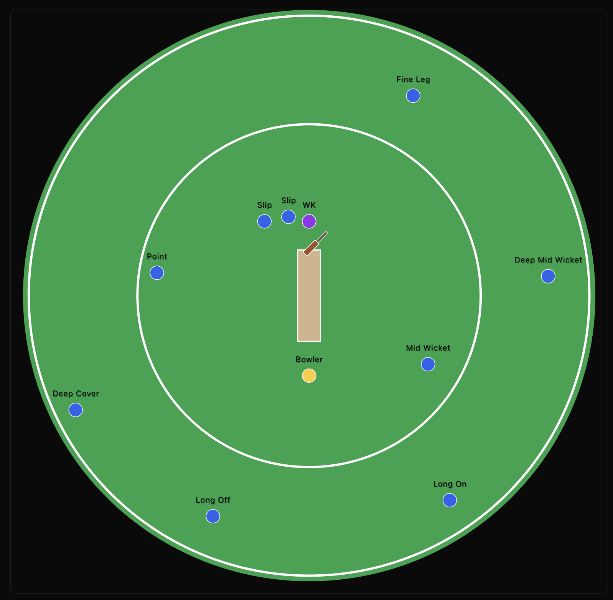

# Cricket Fielding Planner 🏏

A modern web application that helps cricket captains and coaches optimize their fielding strategies and positions in real-time.

## 💡 Overview

Cricket Fielding Planner is an interactive tool that allows you to:
- Visualize and plan fielding positions
- Adapt strategies for Right and Left handed batsman
- Drag and drop the players and field positions automatically changes
- Download the fielding positions for a match in PNG format

## 🤝 Contributing

We welcome contributions! Please feel free to:
- Report bugs
- Suggest new features
- Submit pull requests

Made with ❤️ for cricket enthusiasts worldwide

